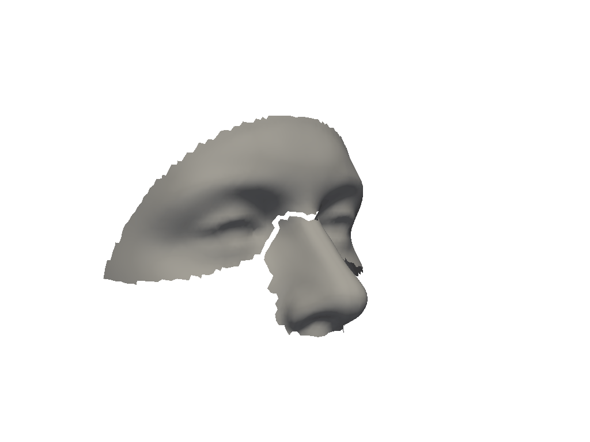
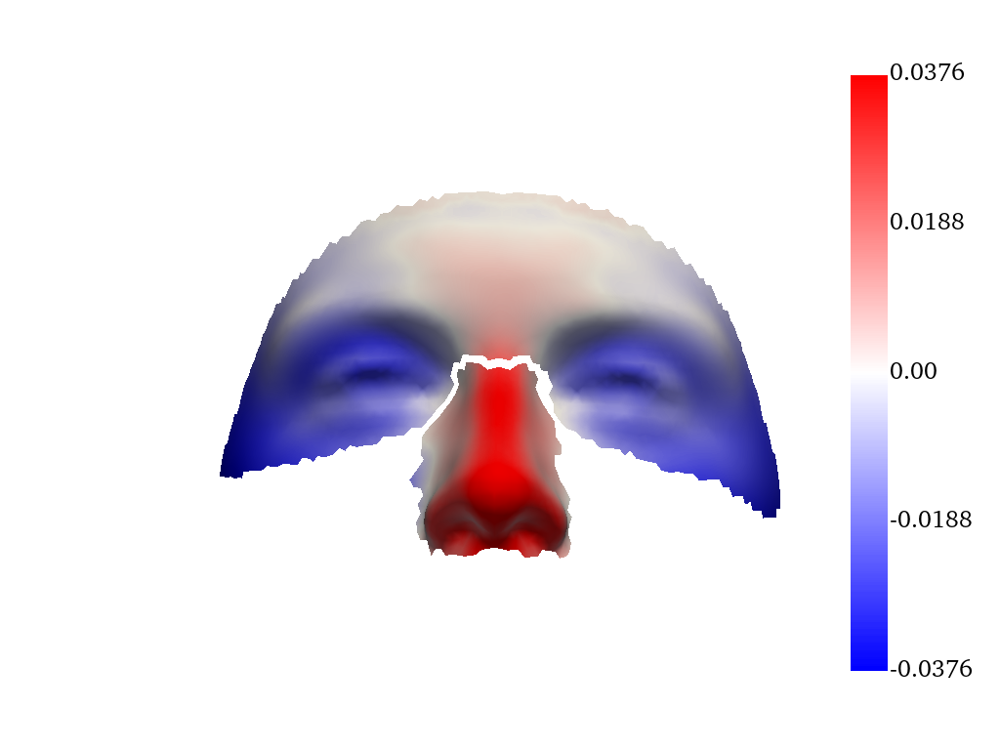

# python_shape_stats
A Python toolbox for statistical shape analysis.

## Explore covariation among anatomical structures with two-block partial least-squares
  

[Read the cookbook](./docs/source/cookbooks/Two-Block_PLS/2B_PLS.ipynb)
