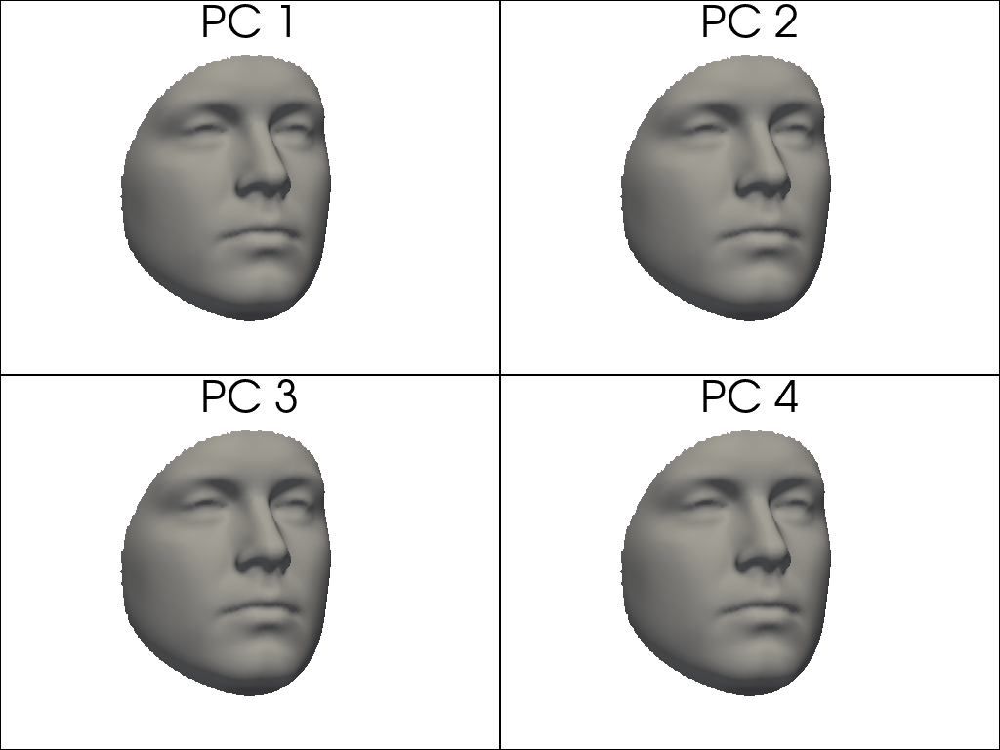
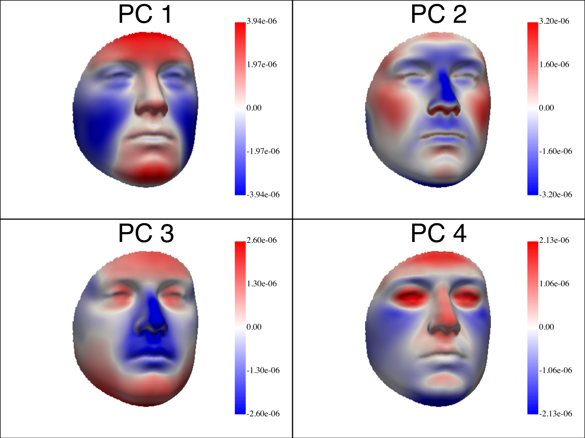
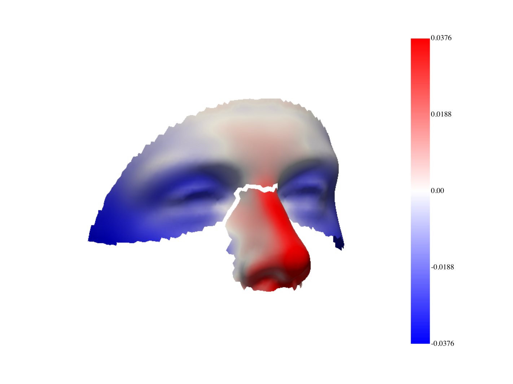
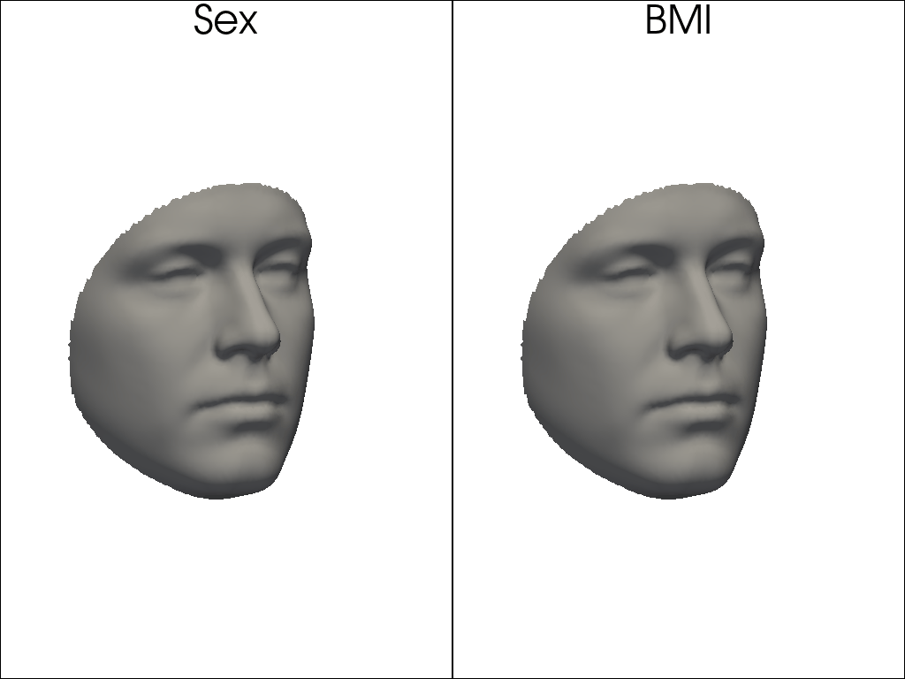
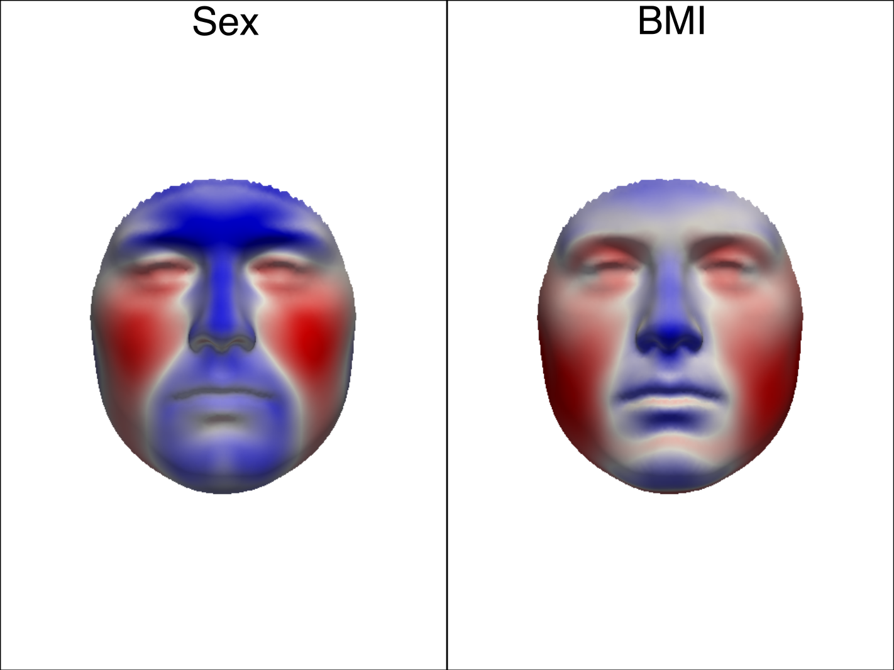

# python_shape_stats
A Python toolbox for statistical shape analysis of dense surface meshes. 
I have given several demo scripts for specific use cases. Feel free to make [feature requests](https://www.prestashop-project.org/get-involved/request-features/#:~:text=To%20create%20a%20feature%20request,Or%20just%20click%20here.&text=Now%20fill%20out%20the%20form,issues%20with%20its%20flavoured%20Markdown.) or suggest new demos. Consider contributing as a pull request. 
## Documentation
You can find the (evolving) project documentation on the [project website](https://harrymatthews50.github.io/python_shape_stats).
## Overview
With this toolbox you can:
### Explore and model shape variation within a sample 
See demos of [principal components analysis](./demos/principal_components_analysis.py) and [determining the number of principal components](./demos/how_many_pcs.ipynb).

 
### Assess covariation between structures 
See demo of [two-block partial least-squares](./demos/2B_PLS.py).

  

### Test statistical hypotheses
 See demo of hypothesis testing using [partial least-squares regression model](./demos/pls_hypothesis_test.py), as first developed [in this paper](https://doi.org/10.1016/j.forsciint.2013.10.021).
 
 

## NOTE
It is required that all meshes be in correspondence prior to analysis. This is usually achieved through non-rigid mesh-to-mesh image registration (see Section 2.2 [of this paper](https://doi.org/10.1146/annurev-biodatasci-122120-111413)). If you have access to MATLAB (or can work with the C++ library directly) I recommend for this [MeshMonk](https://gitlab.kuleuven.be/mirc/meshmonk), introduced in [this paper](https://doi.org/10.1038/s41598-019-42533-y). If you have good experiences with other registration toolboxes please feel free to suggest them as a pull request.

## Installation/quickstart
Follow these instructions to get started in under five minutes.

I suggest handling Python environments (in general) with [Conda](https://docs.anaconda.com/free/anaconda/install/index.html). Once you have conda installed. I would also install [Git](https://git-scm.com/book/en/v2/Getting-Started-Installing-Git) if you haven't already.

### Clone the repository

The following clones the repository into the current folder by typing the following in the command prompt/terminal. This is the easiest way to have the scripts in 'demos' locally on your machine.

```
git clone https://github.com/harrymatthews50/python_shape_stats.git
```

### Make the conda environment and install python shape stats.
On Linux or MacOS the following should be executed in the terminal. On Windows this needs to be done in the special 'Anaconda Prompt' that should have installed when you installed Conda.

```
conda create -n shape_stats
conda activate shape_stats
conda install pip
pip install python_shape_stats
```
### Run a demo script to see if everything runs
Try to run one of the demo scripts in the 'demos' folder that will have downloaded when you cloned the repository. In the first instance try to run them directly from the terminal or Anaconda prompt (on Windows), with the shape_stats environment active. Close any plotting windows that open and see if the script runs to the end without errors.
Note that you will need to change <path> to wherever you have cloned the repo to. 

```
conda activate shape_stats
python <path>/demos/2B_PLS.py
``` 
