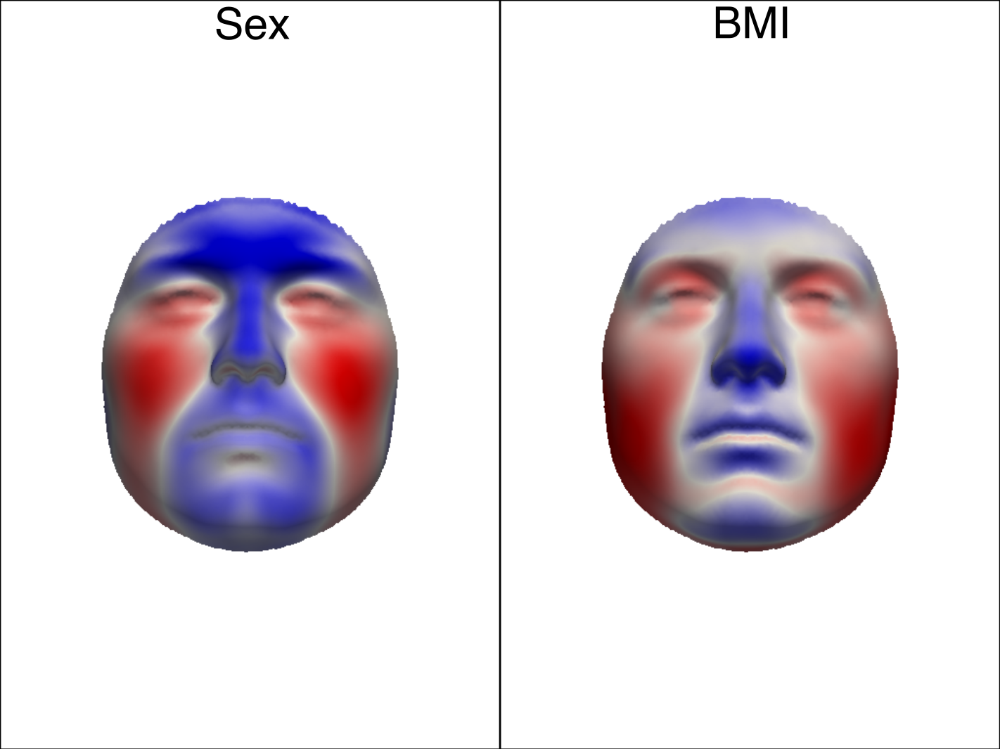

# python_shape_stats
A Python toolbox for statistical shape analysis of dense surface meshes. With this toolbox you can:
You can find project documentation [here](./docs/build/html/index.html)

## Explore and model shape covariation within a sample 
See demos of [principal components analysis](./demos/principal_components_analysis.py) and [determining the number of principal components](./demos/how_many_pcs.ipynb).

 
## Assess covariation between structures 
See demo of [two-block partial least-squares](./demos/2B_PLS.py).

  

## Test hypotheses about the effect of variables on shapes
 See demo of hypothesis testing using [partial least-squares regression model](./demos/pls_hypothesis_test.py), as first developed [in this paper](https://doi.org/10.1016/j.forsciint.2013.10.021). 
 
 

 
 
